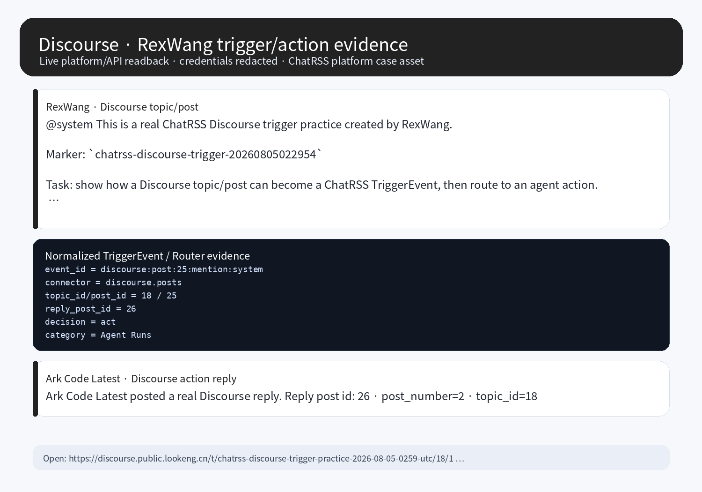

# Discourse Platform Case

The Discourse case proves that forum topics/posts can also become ChatRSS trigger sources. Discourse is better suited for long-lived discussion, task records, and decision history than realtime chat.



## Verified state

| Field | Value |
| --- | --- |
| Platform | Discourse |
| Public URL | https://discourse.public.lookeng.cn |
| Category | `Agent Runs` |
| Actor | `RexWang` / user id `4` / normal user |
| Agent/action account | `ark-code-latest1` |
| Actor post | https://discourse.public.lookeng.cn/t/chatrss-discourse-trigger-practice-2026-08-05-0259-utc/18/1 |
| Reply post | https://discourse.public.lookeng.cn/t/chatrss-discourse-trigger-practice-2026-08-05-0259-utc/18/2 |
| Trigger marker | `chatrss-discourse-trigger-20260805022954` |
| Event id | `discourse:post:25:mention:system` |
| Action | `discourse.post.reply` |
| Evidence screenshot | `docs/assets/platform-cases/discourse-rexwang-conversation.png` |

## Trigger mechanism

```text
RexWang creates a Discourse topic/post in Agent Runs and mentions @system
  -> Discourse creates a real post
  -> the discourse.posts watcher reads topic/post metadata and content
  -> the connector normalizes it into a TriggerEvent
  -> the router decides act
  -> the action account writes a real Discourse reply
  -> logged-in/API/server readback verifies the post and reply
```

The **pre-action** is `RexWang creating/replying to a Discourse post and mentioning @system`. The task intent comes from the post body.

## Normalized event

```json
{
  "source": "discourse",
  "connector": "discourse.posts",
  "event_type": "community.mention.created",
  "event_id": "discourse:post:25:mention:system",
  "subject": {
    "kind": "post",
    "id": 25,
    "topic_id": 18,
    "post_number": 1,
    "category": "Agent Runs"
  },
  "actor": {
    "kind": "user",
    "id": 4,
    "username": "RexWang"
  },
  "payload": {
    "mentions": ["system"],
    "marker": "chatrss-discourse-trigger-20260805022954"
  }
}
```

## Integration path

Discourse is best integrated as a **forum/topic connector**:

1. Watch a selected category, tag, topic, mention, or notification stream.
2. Normalize topics/posts into `TriggerEvent`.
3. Let the router decide whether an agent should act. External writes should default to `draft -> approve -> execute`; controlled practices may write directly.
4. Use the Discourse API, plugin surface, or a safe server-side writer for replies, then verify by readback.

Anonymous Discourse topic JSON may return `403` or only a shell. Acceptance must use a logged-in session, API key, or server-side readback; do not treat anonymous invisibility as absence of the trigger.
