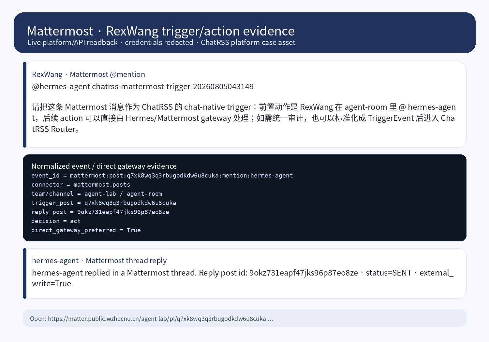

# Mattermost Platform Case

Mattermost is the most natural realtime chat entry point among the three platforms. It already has bot accounts, REST API v4, WebSocket, channel mentions, and thread replies, so **chat-native agent rooms should prefer the Hermes/Mattermost gateway and do not need RSSHub first**.



## Verified state

| Field | Value |
| --- | --- |
| Platform | Mattermost Team Edition |
| Public URL | https://matter.public.wzhecnu.cn |
| Local short alias | `<local-service-alias>` (private deployment shortcut; public docs do not record the concrete local-domain alias) |
| Team / Channel | `agent-lab` / `agent-room` |
| Actor | `RexWang` (Mattermost username: `rexwang`) |
| Bot | `hermes-agent` |
| Trigger post | https://matter.public.wzhecnu.cn/agent-lab/pl/q7xk8wq3q3rbugodkdw6u8cuka |
| Reply post | https://matter.public.wzhecnu.cn/agent-lab/pl/9okz731eapf47jks96p87eo8ze |
| Event id | `mattermost:post:q7xk8wq3q3rbugodkdw6u8cuka:mention:hermes-agent` |
| Action | `mattermost.thread_reply` |
| Evidence screenshot | `docs/assets/platform-cases/mattermost-rexwang-conversation.png` |

## Trigger mechanism

```text
RexWang mentions @hermes-agent in Mattermost agent-room
  -> Mattermost creates a real post event
  -> the Hermes/Mattermost gateway can receive it through WebSocket
  -> or a ChatRSS mattermost.posts connector can normalize the post into TriggerEvent
  -> the router decides act
  -> hermes-agent posts a real Mattermost thread reply
  -> the ledger records trigger/action/readback
```

The **pre-action** is `RexWang @hermes-agent`. The task intent comes from the Mattermost post body.

## Does this need ChatRSS?

Conclusion: **if the goal is simply to bring an agent into a Mattermost room, ChatRSS is not required; the direct Hermes Mattermost gateway is simpler.**

Mattermost already provides a realtime agent entry:

```text
Mattermost WebSocket / REST API
  -> Hermes Mattermost gateway
  -> allowed users/channels / require mention
  -> agent run
  -> thread reply
```

ChatRSS still matters as the unified event, audit, and cross-platform routing layer:

```text
Mattermost post/webhook/WebSocket event
  -> mattermost.posts connector
  -> TriggerEvent
  -> Rule Router / Model Router
  -> optional Action Planner
  -> Ledger
```

So Mattermost does not need RSSHub, but ChatRSS is useful when Mattermost, Zulip, Discourse, and GitHub/RSSHub feeds should share dedupe, routing, audit, and action ledger semantics.

## Normalized event

```json
{
  "source": "mattermost",
  "connector": "mattermost.posts",
  "event_type": "community.mention.created",
  "event_id": "mattermost:post:q7xk8wq3q3rbugodkdw6u8cuka:mention:hermes-agent",
  "actor": {
    "type": "mattermost_user",
    "username": "rexwang",
    "display_name": "RexWang"
  },
  "subject": {
    "type": "mattermost.post",
    "team": "agent-lab",
    "channel": "agent-room",
    "post_id": "q7xk8wq3q3rbugodkdw6u8cuka"
  },
  "raw": {
    "mentions": ["hermes-agent"],
    "marker": "chatrss-mattermost-trigger-20260805043149"
  }
}
```

## Gateway configuration

Mattermost integration config should live in a protected host-side secret store or ChatEnv profile. Public docs describe configuration categories only; they do not expose real file paths, secret-bearing env key names, or credential values.

Configuration categories:

- Mattermost public/base URL
- Bot authentication credential
- Bot username / allowed-actor policy
- Home channel and reply mode
- Mention-required safety switch

## Recommended usage

### Direct agent room

Best for realtime collaboration:

```text
RexWang @hermes-agent
  -> Hermes Mattermost gateway
  -> agent replies in thread
```

This is the simplest path.

### ChatRSS unified router

Best for cross-platform audit:

```text
Mattermost connector
  -> TriggerEvent
  -> Router
  -> shared Ledger
  -> optional Mattermost action executor
```

Use this when Mattermost should share the same event ledger as Zulip, Discourse, and GitHub/RSSHub feed sources.
