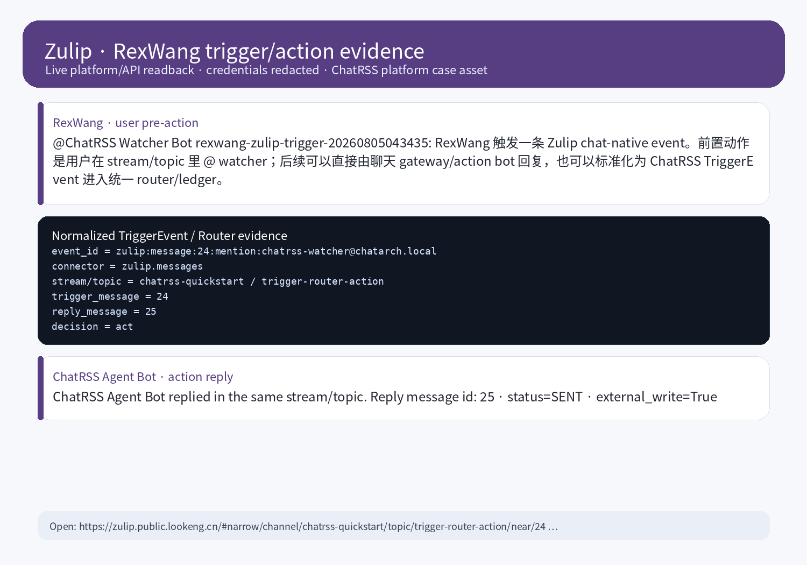

# Zulip Platform Case

The Zulip case proves the event-first model: **a user performs a pre-action in the chat platform before ChatRSS extracts task intent and plans an action**.



## Verified state

| Field | Value |
| --- | --- |
| Platform | Zulip |
| Public URL | https://zulip.public.lookeng.cn |
| Stream / Topic | `chatrss-quickstart` / `trigger-router-action` |
| Actor | `RexWang` |
| Watcher | `ChatRSS Watcher Bot` |
| Action bot | `ChatRSS Agent Bot` |
| Trigger message | https://zulip.public.lookeng.cn/#narrow/channel/chatrss-quickstart/topic/trigger-router-action/near/24 |
| Reply message | https://zulip.public.lookeng.cn/#narrow/channel/chatrss-quickstart/topic/trigger-router-action/near/25 |
| Event id | `zulip:message:24:mention:watcher@example.invalid` |
| Action | `zulip.message.reply` |
| Evidence screenshot | `docs/assets/platform-cases/zulip-rexwang-conversation.png` |

## Trigger mechanism

```text
RexWang mentions ChatRSS Watcher Bot in a Zulip stream/topic
  -> Zulip emits a real message event
  -> the watcher reads the message with its own API key and sees flags=[mentioned]
  -> the connector normalizes the payload into a TriggerEvent
  -> the router decides act
  -> the action bot posts a real reply in the same topic
  -> the ledger records the causal chain
```

The **pre-action** is `RexWang @ ChatRSS Watcher Bot`. The task intent comes from that Zulip message body; the agent is not acting on hidden private instructions.

## Normalized event

```json
{
  "source": "zulip",
  "connector": "zulip.messages",
  "event_type": "community.mention.created",
  "event_id": "zulip:message:24:mention:watcher@example.invalid",
  "actor": {
    "type": "zulip_user",
    "display_name": "RexWang"
  },
  "subject": {
    "type": "zulip.message",
    "stream": "chatrss-quickstart",
    "topic": "trigger-router-action",
    "message_id": 24
  },
  "raw": {
    "mentioned": true,
    "flags": ["mentioned"]
  }
}
```

## Integration path

Zulip is best integrated as a direct **chat/community connector**:

1. Read a stream/topic or event queue using a watcher/bot account API key.
2. Convert only matching messages into `TriggerEvent`, for example `mentioned=true`.
3. Let the router decide whether to run `agent.run` and `zulip.message.reply`.
4. Keep watcher reads and action-bot writes separated.

Zulip does not need RSSHub first. RSSHub is better for feed-like sources; Zulip's native API is the natural trigger connector.
